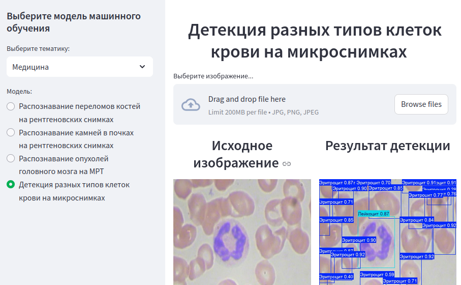

# Streamlit_Image_detection

Распознавание изображений играет важную роль в современных технологиях, 
    и его применение варьируется от автоматического тегирования контента в социальных 
    сетях до обнаружения дефектов на производственных линиях и автономного вождения.
    
    рабочая версия сайта (если она не падала или я нашел время ее поднять) находится по адресу https://detectme.insomnia247.nl
    
    **Этот проект был разработан абсолютно бесплатно с целью тестирования технологии 
    и распространения знаний о ней.** Его цель - помочь людям понять, как работает 
    распознавание изображений на практике и как можно использовать его для решения 
    различных проблем.
    
    По вопросам сотрудничества обращайтесь в группу в ВК https://vk.com/fablabkfuv
    
    или на почту fablab@cfuv.ru
